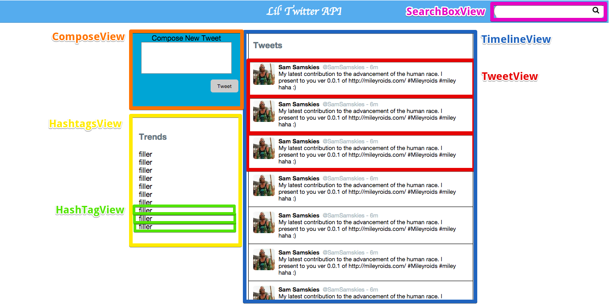

# tweetpage-on-react
This is a Mini Twitter app using React on Rails. The back-end was pre-written, and the front-end view is now entirely rendered by React. This example chooses to use JSX and also uses `React.createClass` over extends `React.component`.


## Lil' Twitter

## Summary

Mission: build a one-page app using  Javascript to render a simple dashboard for a twitter application. The HTML, CSS, and back-end are already written for you -- all you need to do is write the JavaScript.

## Development Setup

requires ruby and rubygems.
```sh
$ bundle install
$ rake db:create && rake db:migrate && rake db:seed
$ rails server
```

## Releases

### Release 0: Architect

Your site needs to have the following functionality:

> - On page load, the 50 most recent tweets are displayed in the 'river' running down the middle of the page.
> - On page load, the 10 most popular hashtags are displayed.
>
> - A user can create a tweet, which will get saved into the database with a fake username, fake handle, and fake avatar (which is all handled server-side).
> - Any hashtags the tweet includes (e.g. #yolo), should also be associated with that tweet.
> - The new tweet should appear atop the 'river', preferrably with some sort of animation.
>
> - A user can search for a specific hashtag using the search bar. The results of the search will be displayed in the river, replacing whatever was there before.
> - If the user searches for a hashtag that does not exist, the search bar turns red.
>
> - A user can click on a trending topic in the trends box, which causes the river to display all tweets that are associated with that hashtag, replacing whatever was there before.
>
> - When a user clicks on the Lil Twitter header, the 50 most recent tweets are displayed.

All of this will be accomplished using JavaScript.

Consider the following diagram, which highlights the different views your
solution might include:




### Endpoint Documentation

`GET /tweets/recent` returns the 50 most recently created tweets in JSON format. The response body looks like this:

  ```json
[
   {
      "avatar_url":"http://robohash.org/marco_schumm",
      "content":"Ut fugit ut labore repellendus.",
      "created_at":"2014-07-20T20:27:42Z",
      "handle":"@marco_schumm",
      "id":500,
      "updated_at":"2014-07-20T20:27:42Z",
      "username":"Adaline Bins",
      "hashtag_names":[
         "est",
         "rerum",
         "distinctio"
      ]
   }
]
  ```

`GET /tweets/search/:hashtag` returns the 50 most recent tweets associated with the given hashtag, with a format similar to the `/recent` endpoint. Will return an empty body with a status code of 404 if the hastag does not exist.

`POST /tweets` creates a new a tweet and associates it with the specified hashtags, if provided. Hashtags that did not previously exist are also created. a request body should take this format:

```json
{
   "tweet":{
      "avatar_url":"http://robohash.org/marco_schumm",
      "content":"Ut fugit ut labore repellendus.",
      "handle":"@marco_schumm",
      "username":"Adaline Bins"
   },
   "hashtags":[
      "foo",
      "bar",
      "baz"
   ]
}
```

If no data is provided for avatar_url, content, handle, or username, fake data is used instead.

The endpoint returns the created tweet as JSON.

  ```json
{
   "avatar_url":"http://robohash.org/Margot Morar II",
   "content":"This is my new tweet",
   "created_at":"2015-07-10T22:18:20Z",
   "handle":"@royal",
   "id":503,
   "updated_at":"2015-07-10T22:18:20Z",
   "username":"Margot Morar II",
   "hashtag_names":[
      "foo",
      "bar",
      "baz"
   ]
}
  ```

`GET /hashtags/popular` returns the names of the 10 most popular hashtags. The output looks like this:

```json
[
   {
      "hashtag_count":"39",
      "name":"labore"
   },
   {
      "hashtag_count":"35",
      "name":"ratione"
   },
   {
      "hashtag_count":"35",
      "name":"architecto"
   },
   {
      "hashtag_count":"33",
      "name":"vero"
   },
   {
      "hashtag_count":"32",
      "name":"ut"
   }
]
```

